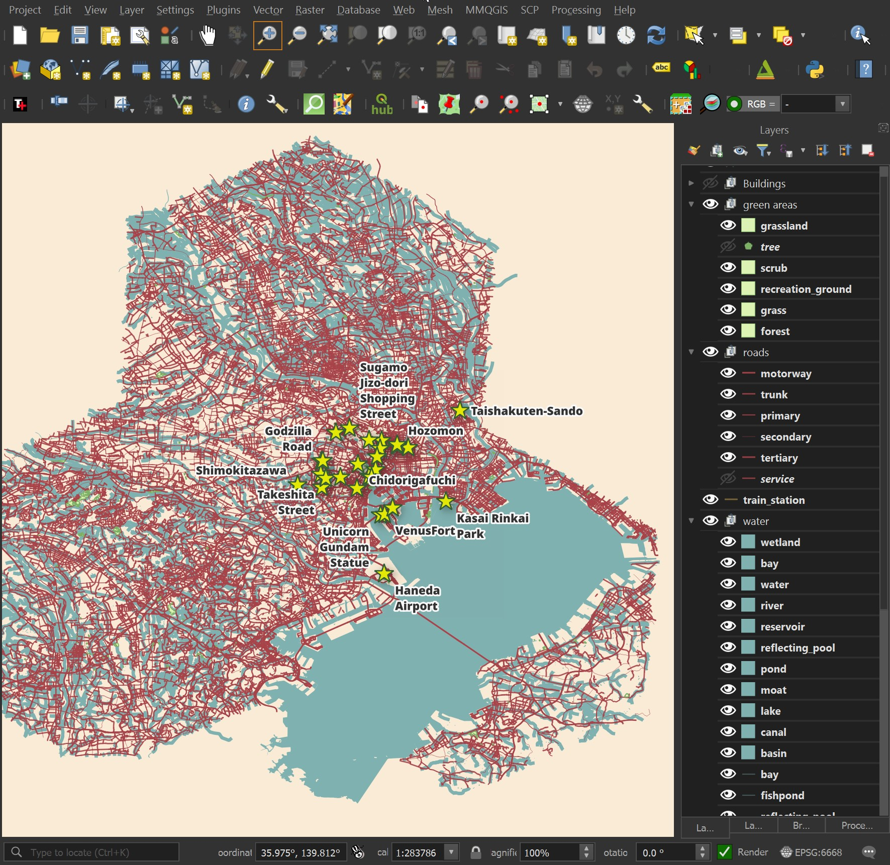

# osm_split

Extract Features from OpenStreetMap (OSM) PBF files into feature-specific, named GeoPackage Files.

Please read https://tech.marksblogg.com/extracting-osm-features.html for installation and usage instructions.

## Usage Example

Extract parts of central Tokyo.

```bash
$ wget https://download.geofabrik.de/asia/japan/kanto-latest.osm.pbf

$ python main.py \
    --only-h3=842f5abffffffff,842f5a3ffffffff,842f5bdffffffff \
    kanto-latest.osm.pbf
```

Here are a few of the resulting GeoPackage files.

```
$ ls -lht */electric*
```

```
2.8M ... points/electric_cables.gpkg
 97K ... multilinestrings/electric_cables.gpkg
 14M ... lines/electric_cables.gpkg
```

```bash
$ ls -lhS lines/building/ | head
```

```
143M ... house.gpkg
 24M ... apartments.gpkg
6.5M ... residential.gpkg
5.0M ... detached.gpkg
3.5M ... retail.gpkg
2.7M ... industrial.gpkg
2.2M ... commercial.gpkg
2.2M ... school.gpkg
1.1M ... greenhouse.gpkg
```

The following is a rendering of a few of the GeoPackage files generated in QGIS:


